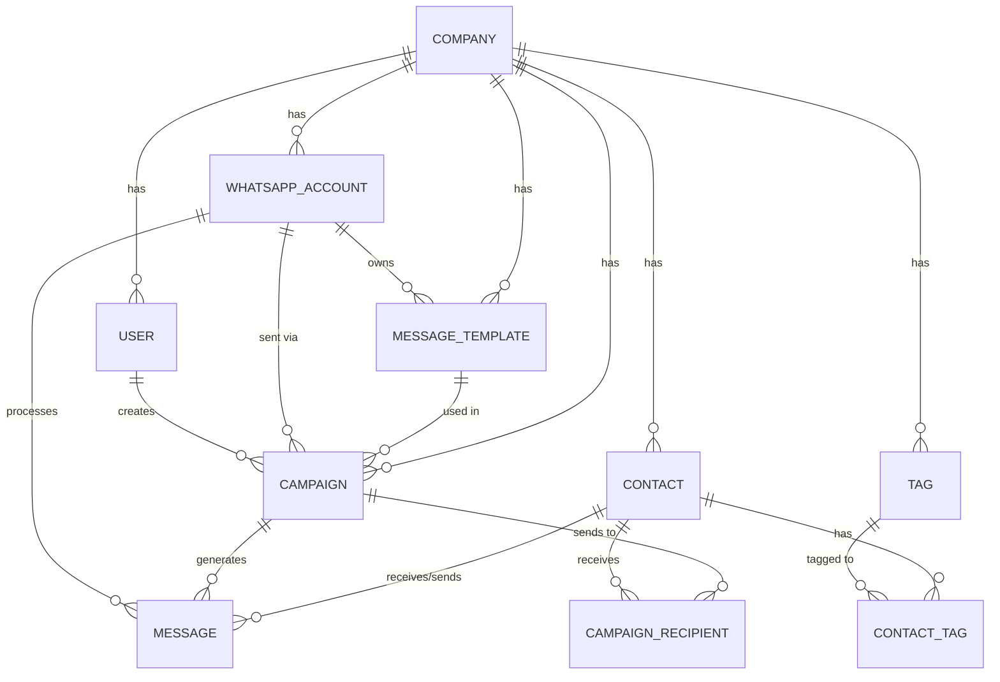

# System Architecture

The Bharat Infotechs WhatsApp CRM is designed as a monolithic, full-stack application optimized for performance, maintainability, and ease of deployment. 

## Technology Stack

### Backend
- **Framework:** NestJS (Node.js)
- **Database:** PostgreSQL
- **ORM:** Prisma
- **Queueing & Background Jobs:** BullMQ (backed by Redis)
- **WhatsApp Integration:** Meta Cloud API (Official)

### Frontend
- **Framework:** React (Create React App)
- **Routing:** React Router v7
- **Styling:** Vanilla CSS (custom design system) + TailwindCSS for utility classes
- **Icons:** Lucide React
- **HTTP Client:** Axios (configured with JWT interceptors)

## Core Domains

### 1. Multi-Tenancy (Companies)
The system is built to support a multi-tenant model. All major entities (`User`, `Contact`, `Campaign`, `MessageTemplate`) are scoped to a `Company`. The API enforces this isolation at the service level, ensuring users can only interact with data belonging to their respective company.

### 2. Contact Management
- Supports manual creation and bulk CSV import.
- Handles E.164 phone number normalisation dynamically (supporting both 10-digit mobiles and 11-digit landlines).
- Includes conflict resolution (merges addresses on duplicate numbers, skipping exact matches).
- Tracks `CrmConsentStatus` (`PENDING`, `OPTED_IN`, `OPTED_OUT`) for compliance.

### 3. WhatsApp Campaign Engine
- Powered by **BullMQ** for reliable, asynchronous processing.
- The `CampaignsService` schedules a `CampaignProcessor` job.
- The processor chunks recipients into manageable batches and dispatches them via the `WhatsAppAdapterService` (wrapping the Meta Cloud API).
- Allows dynamic mapping of user attributes to WhatsApp template variables.

### 4. Webhook Processing
- Receives real-time updates from the Meta Cloud API regarding message status (`sent`, `delivered`, `read`, `failed`) and inbound customer replies.
- The `WebhookProcessor` immediately parses these payloads and updates the CRM state.
- **Opt-Out Compliance:** Automatically scans inbound messages for keywords like "STOP" or "UNSUBSCRIBE" and immediately flips the contact's consent status to `OPTED_OUT`, protecting the WhatsApp Business Account's quality rating.

## Database Schema (Prisma)

A simplified view of the primary relationships:

## Security & Authentication
- **Authentication:** Stateless JWT tokens. 
- **Authorization:** Handled via NestJS Guards (`AuthGuard`) and validated against the `users` table.
- **IDOR Protection:** All data retrieval and mutation services strictly enforce the caller's `companyId`.
